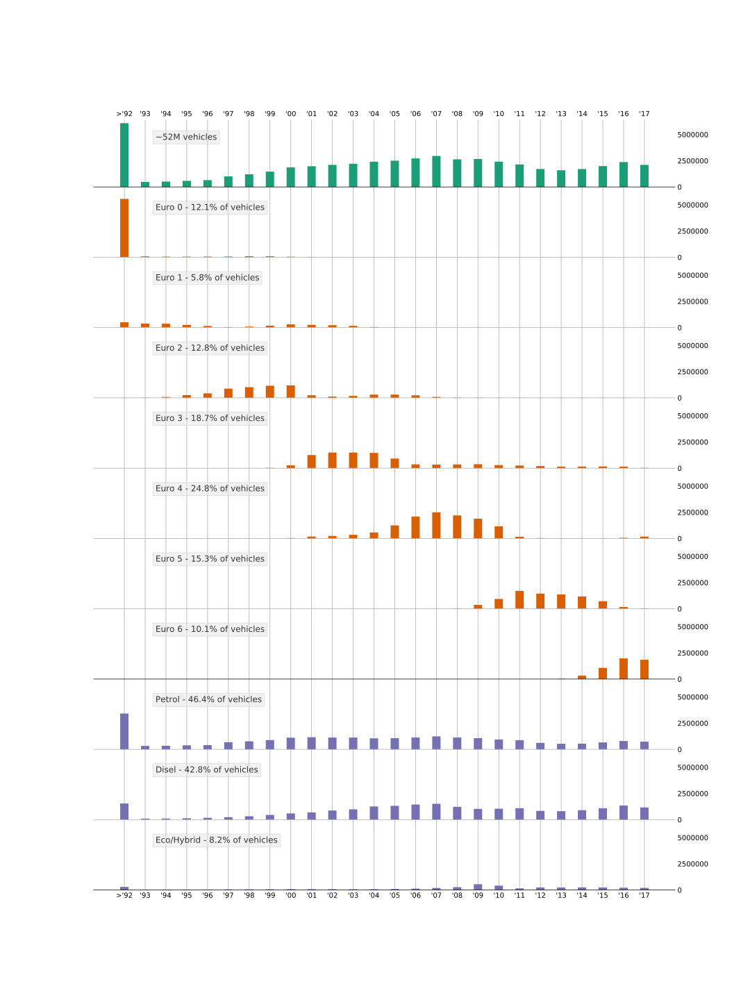

## Overview of the dataset

The [dataset](http://dati.mit.gov.it/catalog/dataset/60a57c60-758c-4bd9-8d87-c286b797c289) comes from the the official Italian Ministero delle Infrastrutture e dei Trasporti, the ministry that keeps track of every vehicle in the Country. The data are published under the [_Creative Commons Attribution Licence_](https://creativecommons.org/licenses/by/4.0/) and its last update (at the moment of writing) was on the **31/10/2017**.

The dataset shows many interesting information coming from all the **52.165.189** vehicles owned by Italians and that are authorized to be driven.

The dataset is provided as *.csv* formatted files divided by regions (hence, 20 chunks).

The [official and extensive documentation](http://dati.mit.gov.it/catalog/dataset/60a57c60-758c-4bd9-8d87-c286b797c289/resource/5d21aa87-a57d-42ee-b504-7da3218152be/download/metadata-parco-circolante-vetture.pdf) about the fields of the dataset is available on the same portal.

The data (7.7GB compressed) have been imported into a SQLite database that will give us the chance to consume them in a very flexible way.

## The aim of the project

The goal of this project is to explore the current status of the Italian vehicles and draw (possibly) interesting insights from the data. The secondary goal of the project is to study how much our vehicles are eco-friendly.


## Exploratory analysis

To draw inspiration and insight from the data, let's begin from explore them.

```{r message=FALSE, include=FALSE}
library(RSQLite)
library(ggplot2)
library(scales)
library(dplyr)
library(plotly)
library(purrr)
library(maptools)
library(GISTools)
```

```{r message=FALSE, include=FALSE, warning=FALSE}
national_map <- readShapePoly('shapefiles/Reg_2016_WGS84_g.shp')

std_name <- function(names) {
  sapply(substr(names, 0, 4), tolower)
}

normalize <- function(df, colname) {
  df <- df %>%
    slice(match( std_name(national_map$REGIONE), std_name(regione_residenza) ))
  
  sizes <- population %>%
    slice(match( std_name(national_map$REGIONE), std_name(Regioni) )) %>%
    dplyr::select(Maschi...Femmine)
  
  df[colname] <- df[colname] / as.integer(sizes[[1]])
  df
}

plot_on_national_map <- function(query_result, norm=TRUE, n_col=8) {
  values <- query_result %>%
    slice(match( std_name(national_map$REGIONE), std_name(regione_residenza) )) %>%
    dplyr::select(1)
  
  values <- values[[1]]
  
  shades <- auto.shading(values, cutter=rangeCuts, n=n_col, cols=brewer.pal(n_col,'YlOrRd'))
  choropleth(national_map, values, shades, lwd=.2)
}

rgb_blue = rgb(0.10980392, 0.56470588, 0.6)
rgb_yellow = rgb(0.99607843, 0.76862745, 0.30980392)
```


```{r}
db <- dbConnect(SQLite(), dbname="italian_vehicles.sqlite")
population <- read.csv('regioni.csv')
composition <- read.csv('regioni_comp.csv')
```

We already know that we are dealing with more than 52 millions of vehicles and it can be interesting to compare this number to the number of people that actually live in Italy.

We will extract the data about the Italian population from the [Istat platform](http://www.demo.istat.it/pop2018/). This data are the estimated sizes of the populations divided by region. It worth to mention that this estimation also include those people that cannot drive yet or cannot anymore.

We will use the data updated to 01/01/2018, the closest possible to last update to the vehicles dataset.

```{r}
n_vehicles <- dbGetQuery(db, 'SELECT count(*) AS n_vehicles FROM vehicles')[[1]]
n_people <- sum(population$Maschi...Femmine)[[1]]

vehicles2people_ratio <- n_vehicles / n_people
cat("The ratio between vehicles and people in Italy:", vehicles2people_ratio)
```

It's a pretty high number if we take into account the clarifications made above.

### Dataset structure

The dataset contains a vast amount of interesting informations like: municipality, province and region of residence of the owner, the type of vehicle and which is its main pourpose, the amount of emissions, the type of fuel, the date of the registration and some few others more.

The mentioned one are almost all specified for each vehicles, the other are less relevant since they have a lot of missing data.

This dataset contains the information about how each vehicle is been used, let's visualize them

```{r}
res <- dbGetQuery(db, 'SELECT count(*) AS n, destinazione FROM vehicles GROUP BY destinazione ORDER BY n DESC')

n_cat <- 3
df = rbind( res[1:n_cat,], c(sum(res[-(1:n_cat), 1]), 'OTHERS') )
df$n = as.integer(df$n)

ggplot(df, aes(x="", y=n, fill=destinazione)) +
  geom_col() +
  scale_fill_brewer(palette="PuBuGn") +
  geom_text(aes(x=rep(1.2, n_cat+1), label = scales::percent(n / n_vehicles)), position = position_stack(vjust = 0.5)) +
  coord_polar("y") + 
  theme_void()
```

The vast majority of the dataset is made up by private cars, actually. These, along with the motocycles, constitute around the 88% of the vehicles that are active on our territory.

We can already state that, if we want to reduce the CO2 emissions, the private sector is the right place to look into. The secon place is occupied by the TIRs for moving goods and food but they represent just a tiny fraction of the whole. The rest is given by agricoltural means and special reserved vehicles (Police, Firefighters, Ambulances, ...).

### Registered vehicles over time

This dataset keeps track of every vehicle that, potentially, could be driven on the roads. So it includes also historical cars or vehicles non longer mainteined but not dismantled yet.

Let's see how the current vehicles have been registered over time.

```{r}
res <- dbGetQuery(db, 'SELECT strftime("%Y", data_immatricolazione) AS year, count(*) AS n FROM vehicles WHERE year > "1991" GROUP BY year')
res2 <- dbGetQuery(db, 'SELECT ">1991" AS year, count(*) AS n FROM vehicles WHERE strftime("%Y", data_immatricolazione) <= "1991"')

df = rbind(res, res2)

ggplot(df, aes(year, n)) +
  geom_bar(stat="identity", fill="#1c9099") +
  theme(axis.text.x = element_text(angle = 45, hjust = 1)) +
  xlab("") + ylab("n° of registered cars")
```

It is striking to notice that we still have many thousands of vehicles that have been registered **more than 28 years ago**!

It ss also very easy to spot the **financial crysis** (around 2013): less money to register new cars.

### Average age

We have seen that, actually, we are sorrounded by pretty old vehicles. That is surprising so, let's have a look at the average of age of the vehicles and let's do it by dividing the results by region to see if some patterns emerge.

```{r fig.width = 12, warning=FALSE}
df <- dbGetQuery(db, 'SELECT avg(strftime("%Y", "2017-10-31") - strftime("%Y", data_immatricolazione)) AS eta_media, regione_residenza FROM vehicles GROUP BY regione_residenza')
df = df[order(df$eta_media, decreasing=TRUE),]

layout(matrix(c(1,1,2), nrow = 1, ncol = 3))

par(mar=c(13,5,5,3))
barplot(df$eta_media, col=rgb_blue, border=rgb_blue, names.arg=df$regione_residenza, las=2, ylab="Average age")
abline(h=mean(df$eta_media), col=rgb_yellow, lwd=3)

par(mar=c(2,1,2,1))
plot_on_national_map(df)
```

So the average age of a vehicle in Italy is **around 12-13 years**. But, more interesting, the distribution of the averages per region is very different and follow the virtual borders given from the **meridional issue**: in the south we can see older vehicles (the average is more than 15 years for some regions), in the north we see newer vehicles (around 11 years). The factor behind this patter could be potentially a lot and we will not dig into it further in this presentation.

The **two outliers** of this plot are clearly _Valle d'Aosta_ and _Trentino-Alto Adige_. Their car have an average age around only 6 years, the half of the Italian average.

### Number of vehicles

We know the number of vehicles in total and it's very easy to know the same number split by regions but it wouldn't be fair without normalizing them to the number of actual people that live in each region.

```{r fig.width = 12, warning=FALSE}
df <- dbGetQuery(db, 'SELECT count(*) AS n, regione_residenza FROM vehicles GROUP BY regione_residenza')
df = normalize(df, "n")
df = df[order(df$n, decreasing=TRUE),]

layout(matrix(c(1,1,2), nrow = 1, ncol = 3))

par(mar=c(13,5,5,3))
barplot(df$n, col=rgb_blue, border=rgb_blue, names.arg=df$regione_residenza, las=2, ylab="Average vehicles per person")
abline(h=mean(df$n), col=rgb_yellow, lwd=3)

par(mar=c(2,1,2,1))
plot_on_national_map(df)
```

We can see that the average is pretty balanced and doesn't seem to follow a particular pattern. But there are still the same outlier of before showing another surpising result: in _Valle d'Aosta_ they almost have **2 vehicles per person**. It's very remarkable reminding that inside the estimated number of inhabitants there are also children! For sure there must be an explaination to this. Let's go on for the moment.

### Type of fuel

Let's turn our gaze to the positive side: let's count the (normalized) number of vehicles that make use of more eco-friendly ways of moving. We will select all the vehicles that are electric, hybrids or make use of gases.

```{r fig.width = 12, warning=FALSE}
df <- dbGetQuery(db, 'SELECT count(*) AS n, regione_residenza From vehicles where alimentazione IN ("ELETTR", "GPL", "METANO", "B/ETA", "B/GPL", "B/MET") OR alimentazione LIKE "IBRIDO%" GROUP BY regione_residenza')
df = normalize(df, "n")
df = df[order(df$n, decreasing=TRUE),]

layout(matrix(c(1,1,2), nrow = 1, ncol = 3))

par(mar=c(13,5,5,3))
barplot(df$n, col=rgb_blue, border=rgb_blue, names.arg=df$regione_residenza, las=2, ylab="Eco/Hybrid vehicles per person")
abline(h=mean(df$n), col=rgb_yellow, lwd=3)

par(mar=c(2,1,2,1))
plot_on_national_map(df)
```

This time we have a huge difference across the Peninsula. Still it follows the pattern of the meridional issue but here, in the center of Italy, we can find the highest density of more eco-friendly vehicles.

### Emissions per region

Let's now analyse the other side, the pollution. We will continue the research looking where the CO2 emissions are more concentrated. We will normalize also this data by the number of people the live in each region.

```{r fig.width = 12, warning=FALSE}
df <- dbGetQuery(db, 'SELECT sum(emissioni_co2) AS emissioni, regione_residenza FROM vehicles GROUP BY regione_residenza')
df = normalize(df, "emissioni")
df = df[order(df$emissioni, decreasing=TRUE),]

layout(matrix(c(1,1,2), nrow = 1, ncol = 3))

par(mar=c(13,5,5,3))
barplot(df$emissioni, col=rgb_blue, border=rgb_blue, names.arg=df$regione_residenza, las=2, ylab="Emissions (g/km per person)")
abline(h=mean(df$emissioni), col=rgb_yellow, lwd=3)

par(mar=c(2,1,2,1))
plot_on_national_map(df)
```

It seems that exist a very strong link with the number of vehicles and the amount of emissions per person disregarding the impact of eco-friendly means of transport. It could seem very obvious since, actually, the amount of green vehicles it's very scarce.

### Registered cars by euro class and fuel over time



This data have on the _y_ axis the same unit: it's easy to see how we are still far from an ideal situation. The presence of higher euro class seems to impact just a few on the final balance. Maybe we should start considering reducing the number of vehicles.

### Interactive plot

Since we hava a lot of data, is good to interact with them to explore them in a deeper way. In particular here will be possible to see, per each region, how the total percentage of number of vehicles is related to the total percentages of different variables. We assume that, ideally, the two percentages should be equal always to be in a balanced situation, of course, as we saw, we are not in that scenario.

```{r}
pc_co2 <- dbGetQuery(db, 'SELECT sum(emissioni_co2) / (SELECT sum(emissioni_co2) FROM vehicles) AS "pc_emissions", regione_residenza FROM vehicles GROUP BY regione_residenza')
pc_n <- dbGetQuery(db, 'SELECT cast(count(*) AS float) / (SELECT count(*) FROM vehicles) AS "pc_total", regione_residenza FROM vehicles GROUP BY regione_residenza')

pc_euro4p <- dbGetQuery(db, 'SELECT cast(count(*) AS float) / (SELECT count(*) FROM vehicles) AS "pc_euro4p", regione_residenza FROM vehicles WHERE classe_euro IN ("4", "5", "6") GROUP BY regione_residenza')

pc_petrol <- dbGetQuery(db, 'SELECT cast(count(*) AS float) / (SELECT count(*) FROM vehicles) AS "pc_petrol", regione_residenza FROM vehicles WHERE alimentazione = "BENZ" GROUP BY regione_residenza')
pc_disel <- dbGetQuery(db, 'SELECT cast(count(*) AS float) / (SELECT count(*) FROM vehicles) AS "pc_disel", regione_residenza FROM vehicles WHERE alimentazione = "GASOL" GROUP BY regione_residenza')
pc_eco <- dbGetQuery(db, 'SELECT cast(count(*) AS float) / (SELECT count(*) FROM vehicles) AS "pc_ecohybrid", regione_residenza FROM vehicles WHERE alimentazione IN ("ELETTR", "GPL", "METANO", "B/ETA", "B/GPL", "B/MET") OR alimentazione LIKE "IBRIDO%" GROUP BY regione_residenza')


regional_data <- list(pc_co2, pc_n, pc_euro4p, pc_petrol, pc_disel, pc_eco) %>% reduce(full_join, by = "regione_residenza")

p <- plot_ly(regional_data, x=~pc_total, y=~pc_emissions, text=~paste(regione_residenza)) %>%
  layout(
    yaxis = list(title="Selected variable"),
    updatemenus = list(
      list(
        y = 0.8,
        buttons = list(

          list(method = "restyle",
               args = list("y", list(regional_data$pc_emissions)),
               label = "% emissions"),
          list(method = "restyle",
               args = list("y", list(regional_data$pc_petrol)),
               label = "% Petrol"),
          list(method = "restyle",
               args = list("y", list(regional_data$pc_euro4p)),
               label = "% Euro 4+"),
          list(method = "restyle",
               args = list("y", list(regional_data$pc_disel)),
               label = "% Disel"),
          list(method = "restyle",
               args = list("y", list(regional_data$pc_ecohybrid)),
               label = "% Eco/Hybrid")))
    )
  )

p
```

## Trivia

### What's wrong with Valle d'Aosta and Trentino?

Those two outliers deserve a special care in order tho explain their behaviour. Of course here we cannot take everything into account (it would be nother research topic). My intuition behind this strange case was that it could be simply related to the difficulty of moving in a territory made up by **only mountains**.

A quick surf on [wikipedia](https://it.wikipedia.org/wiki/Zone_altimetriche_d%27Italia#Le_regioni_in_cifre) gave me some data about the percentage of mountains by region.

```{r}
df <- dbGetQuery(db, 'SELECT count(*) AS n, regione_residenza FROM vehicles GROUP BY regione_residenza')
df <- df %>%
  slice(match( std_name(composition$Regione), std_name(regione_residenza) )) %>%
  bind_cols(composition[, 2:4])

df = normalize(df, "n")

fit <- lm(n ~ X..montagna, data = df)

df %>%
  plot_ly(x = ~X..montagna, text=~paste(regione_residenza)) %>%
  add_markers(y = ~n, name="") %>%
  add_lines(x = ~X..montagna, y = fitted(fit), name="regression") %>%
  layout(xaxis = list(title="% of mountains"), yaxis = list(title="Average car per person"))
```

Actually the result is not very satisfying but, as initial guess, could hold.

### The oldest vehicle

By this simple query we extracted the record of the oldest registered vehicle.

```{sql eval=FALSE}
SELECT * FROM vehicles WHERE data_immatricolazione != "" ORDER BY data_immatricolazione ASC LIMIT 1;
```

It is a motorbike owned by an old man of 75 years that has been **registered in 1854**. It's in the region considered the capital of the two wheels: Emilia-Romagna, in the province of Parma. I like to imagine this happy old man with his motorbike that for sure has a lot of nice and old memories to tell.


## The challenge of managing 52M rows

Speaking of about 52M rows equals speaking about enough data to define them "big". To manage big dataset there are many techniques that requires splitting the computing load on different processes or even different machines.

Our aim is simply to use the resources available on a normal average notebook but, unfortunately, to run even a simple counting query it takes several minutes. This is due to the amount of the rows but also the the standard behaviour of SQLite when importing data from a *.csv* file: all the columns are treated as text so it cannot create proper and efficient indexes to manage the informations in a optimized way.

Of course it's nearly impossible to work and analyse data in real-time with these constraints so we need a solution that can allow us to have a proper exploratory analysis without waiting too much for getting any query executed.

Operating some simple tricks it's possible to solve the situation: in first place it's possible to subsample randomly the data in such a way that the sample keeps intact the proportional quantities present in the original dataset and secondly it's possible to transform some columns into integers and to create on them some indexes. These solutions have provided an incredible speedup (queries now executes in a matter of seconds).

```{sql eval=FALSE}
-- Query used for subsampling the dataset
INSERT INTO vehicles_sub SELECT * FROM vehicles WHERE id IN (SELECT id FROM vehicles ORDER BY RANDOM() LIMIT 1000000);
```

_The subsampled dataset is used only in the development phase simply to drive decisions and give a preliminary idea of the results. The final render of the document is done using the whole dataset._

## Conclusions

This analysis gave me a lot of insight in many fields that I didn't know. Moreover it changed and twisted my opinions under many points of view.

Speaking about the problem of pollution, it seems we're not making enough efforts to a more eco-friendly world: the electric shift is still far from affordable and the numbers of registered cars over the year seems to confirm it. Since the current amount of emissions is so linked to the number of vehicles (cars, actually) we own, the fastest way for having an healthier environment would be simply to cut the usage of cars.

Of course many of the conclusions and the judgments done are subject to big possible mistakes: from a registry of vehicles and without taking into account the dynamics, it's very hard to be completely right.

